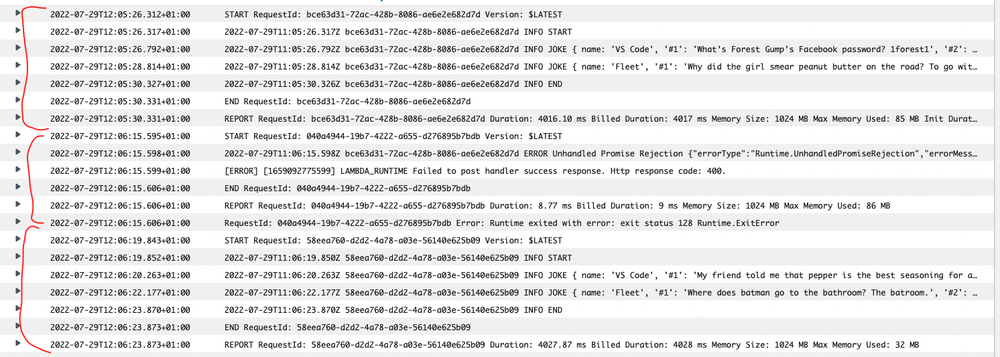

# Laconia batch test

Test input

```json
[
    {
        "name": "VS Code"
    },
    {
        "name": "Fleet"
    },
    {
        "name": "Eclipse"
    }
]
```

Logs for the first 3 invocations


